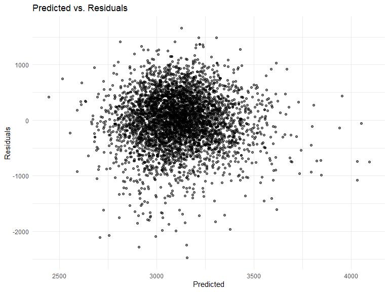
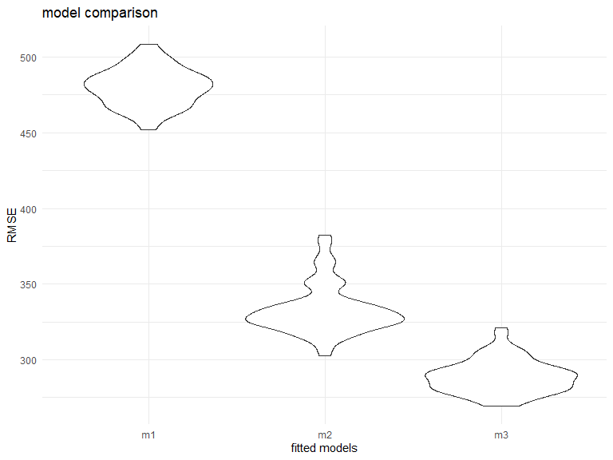
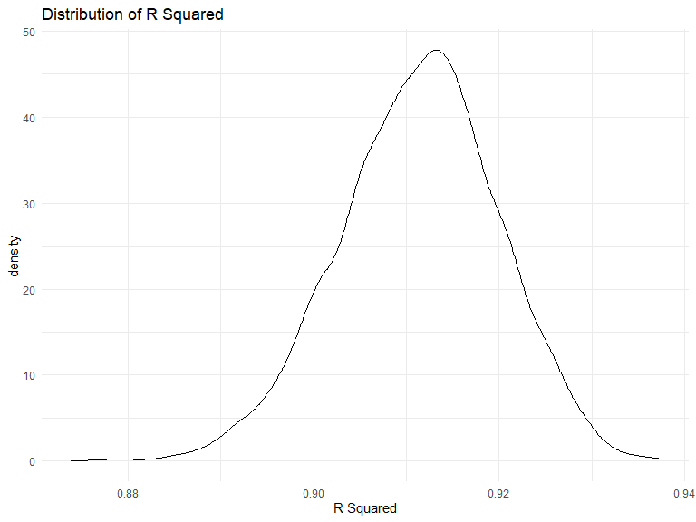
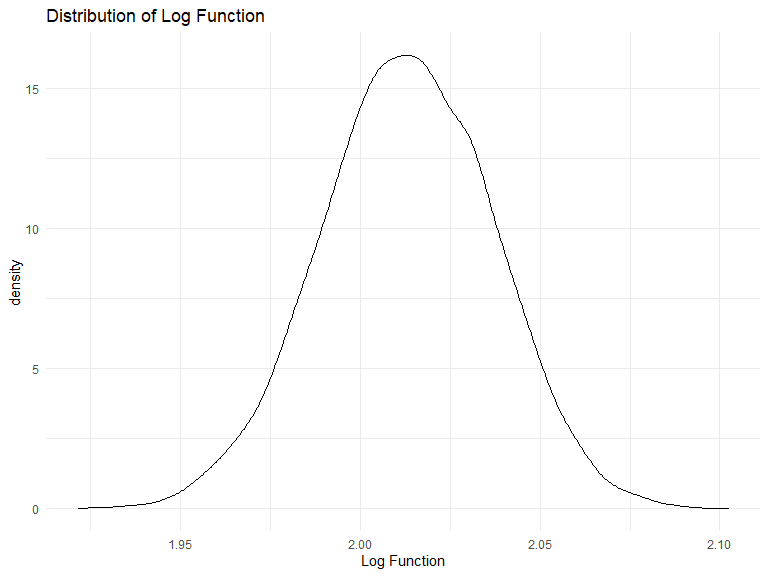

P8105\_hw6\_qh2251
================
Paulina Han
2021/11/25

# Problem 1

``` r
#raw data
df_raw = read.csv("birthweight.csv", na = c("", "NA", "Unknown"))

#clean version
df_tidy = df_raw %>% 
  mutate(babysex = as.factor(babysex),
         frace = as.factor(frace),
         malform = as.factor(malform),
         mrace = as.factor(mrace),
         ) 

#check missing values  
sum(is.na(df_tidy))
```

    ## [1] 0

The data set contains 4342 observations and 20 variables.I converted
`babysex`, `frace`, `malform` and `mrace` into factors. There are no
missing values in the data set.

``` r
#fitting model from paper:DOI: 10.1016/j.orcp.2007.09.001
# wtgain:total weight gain
# smoken: average number of cigarettes smoked per day during pregnancy
# parity: number of live births prior to this pregnancy
# babysex: baby’s sex (male = 1, female = 2)
# ppbmi: mother’s pre-pregnancy BMI
# momage: mother’s age at delivery (years)

#model 1 
lm1 = lm(bwt ~ wtgain + smoken + parity + babysex + ppbmi + momage, data = df_tidy)

summary(lm1)
```

    ## 
    ## Call:
    ## lm(formula = bwt ~ wtgain + smoken + parity + babysex + ppbmi + 
    ##     momage, data = df_tidy)
    ## 
    ## Residuals:
    ##      Min       1Q   Median       3Q      Max 
    ## -2476.89  -277.46    20.63   317.81  1662.28 
    ## 
    ## Coefficients:
    ##              Estimate Std. Error t value Pr(>|t|)    
    ## (Intercept) 2090.0223    65.8599  31.734  < 2e-16 ***
    ## wtgain        12.8160     0.6764  18.947  < 2e-16 ***
    ## smoken        -6.7603     0.9925  -6.811 1.10e-11 ***
    ## parity       -88.2333    71.3052  -1.237    0.216    
    ## babysex2     -75.5447    14.6811  -5.146 2.78e-07 ***
    ## ppbmi         17.9300     2.3221   7.722 1.42e-14 ***
    ## momage        20.6709     1.9112  10.816  < 2e-16 ***
    ## ---
    ## Signif. codes:  0 '***' 0.001 '**' 0.01 '*' 0.05 '.' 0.1 ' ' 1
    ## 
    ## Residual standard error: 482.6 on 4335 degrees of freedom
    ## Multiple R-squared:  0.1134, Adjusted R-squared:  0.1121 
    ## F-statistic: 92.38 on 6 and 4335 DF,  p-value: < 2.2e-16

``` r
broom::tidy(lm1) %>% 
  knitr::kable(digits = 3)
```

| term        | estimate | std.error | statistic | p.value |
|:------------|---------:|----------:|----------:|--------:|
| (Intercept) | 2090.022 |    65.860 |    31.734 |   0.000 |
| wtgain      |   12.816 |     0.676 |    18.947 |   0.000 |
| smoken      |   -6.760 |     0.993 |    -6.811 |   0.000 |
| parity      |  -88.233 |    71.305 |    -1.237 |   0.216 |
| babysex2    |  -75.545 |    14.681 |    -5.146 |   0.000 |
| ppbmi       |   17.930 |     2.322 |     7.722 |   0.000 |
| momage      |   20.671 |     1.911 |    10.816 |   0.000 |

``` r
#plot 
df_tidy %>% 
  add_predictions(lm1) %>% 
  add_residuals(lm1) %>% 
  ggplot(aes(x = pred, y = resid)) + 
  geom_point(alpha = 0.5)+
  labs(
    title = "Predicted vs. Residuals",
    x = "Predicted",
    y = "Residuals"
    ) 
```



To predict the value of birth weight，I include `wtgain`:mother’s total
weight gain, `smoken`: average number of cigarettes smoked per day
during pregnancy , `parity` : number of live births prior to this
pregnancy, `babysex` : baby’s sex (male = 1, female = 2), `ppbmi` :
mother’s pre-pregnancy BMI, `momage` : mother’s age at delivery (years)
in a linear model. I picked out these predictors according to a study
done by Kari Johansson in 2007. Here is the
[link](https://www.sciencedirect.com/science/article/pii/S1871403X07000622?via%3Dihub)
to their interesting paper in predicting child’s birth weight.

We can see from the “Predicted vs. Residuals” plot that the average
residuals is approximately 0 and the average predicted is around 3000.

``` r
#model2: using length at birth and gestational age as predictors (main effects only)
m2 = lm(bwt ~ blength + gaweeks, data = df_tidy) 
summary(m2)
```

    ## 
    ## Call:
    ## lm(formula = bwt ~ blength + gaweeks, data = df_tidy)
    ## 
    ## Residuals:
    ##     Min      1Q  Median      3Q     Max 
    ## -1709.6  -215.4   -11.4   208.2  4188.8 
    ## 
    ## Coefficients:
    ##              Estimate Std. Error t value Pr(>|t|)    
    ## (Intercept) -4347.667     97.958  -44.38   <2e-16 ***
    ## blength       128.556      1.990   64.60   <2e-16 ***
    ## gaweeks        27.047      1.718   15.74   <2e-16 ***
    ## ---
    ## Signif. codes:  0 '***' 0.001 '**' 0.01 '*' 0.05 '.' 0.1 ' ' 1
    ## 
    ## Residual standard error: 333.2 on 4339 degrees of freedom
    ## Multiple R-squared:  0.5769, Adjusted R-squared:  0.5767 
    ## F-statistic:  2958 on 2 and 4339 DF,  p-value: < 2.2e-16

``` r
#model3:using head circumference, length, sex, and all interactions (including the three-way interaction) between these
m3 = lm(bwt ~ bhead * blength * babysex, data = df_tidy) 
summary(m3)
```

    ## 
    ## Call:
    ## lm(formula = bwt ~ bhead * blength * babysex, data = df_tidy)
    ## 
    ## Residuals:
    ##      Min       1Q   Median       3Q      Max 
    ## -1132.99  -190.42   -10.33   178.63  2617.96 
    ## 
    ## Coefficients:
    ##                          Estimate Std. Error t value Pr(>|t|)    
    ## (Intercept)            -7176.8170  1264.8397  -5.674 1.49e-08 ***
    ## bhead                    181.7956    38.0542   4.777 1.84e-06 ***
    ## blength                  102.1269    26.2118   3.896 9.92e-05 ***
    ## babysex2                6374.8684  1677.7669   3.800 0.000147 ***
    ## bhead:blength             -0.5536     0.7802  -0.710 0.478012    
    ## bhead:babysex2          -198.3932    51.0917  -3.883 0.000105 ***
    ## blength:babysex2        -123.7729    35.1185  -3.524 0.000429 ***
    ## bhead:blength:babysex2     3.8781     1.0566   3.670 0.000245 ***
    ## ---
    ## Signif. codes:  0 '***' 0.001 '**' 0.01 '*' 0.05 '.' 0.1 ' ' 1
    ## 
    ## Residual standard error: 287.7 on 4334 degrees of freedom
    ## Multiple R-squared:  0.6849, Adjusted R-squared:  0.6844 
    ## F-statistic:  1346 on 7 and 4334 DF,  p-value: < 2.2e-16

``` r
#cross validation
#split in to train and test
cv_df =
  crossv_mc(df_tidy, 100) %>% 
  mutate(
    train = map(train, as_tibble),
    test = map(test, as_tibble))

#calculating rmse
cv_df = 
  cv_df %>% 
  mutate(
    model1  = map(train, ~lm(bwt ~ wtgain + smoken + parity + babysex + ppbmi + momage, data = .x)),
    model2  = map(train, ~lm(bwt ~ blength + gaweeks, data = .x)),
    model3  = map(train, ~lm(bwt ~ bhead * blength * babysex, data = as_tibble(.x)))) %>% 
  mutate(
    rmse_m1 = map2_dbl(model1, test, ~rmse(model = .x, data = .y)),
    rmse_m2 = map2_dbl(model2, test, ~rmse(model = .x, data = .y)),
    rmse_m3 = map2_dbl(model3, test, ~rmse(model = .x, data = .y)))

#result comparison
result =  cv_df %>% 
  select(starts_with("rmse")) %>% 
  pivot_longer(
    everything(),
    names_to = "model", 
    values_to = "rmse",
    names_prefix = "rmse_")  %>% 
  mutate(model = fct_inorder(model)) 

# violin plot of rmse
result%>% 
  ggplot(aes(x = model, y = rmse)) + 
  geom_violin()+
  labs(
    title = "model comparison",
    x = "fitted models",
    y = "RMSE"
    ) 
```



The violin plot illustrates the root-mean-square error (RMSE) across
models.We can see from the plot that model 1 is having largest rmse and
model 3 has the smallest rmse which implies if we want to have more
accurate prediction of child’s birth weight we should use model 3
compairing with model 1 and 2.

# Problem 2

``` r
#load the data
weather_df = 
  rnoaa::meteo_pull_monitors(
    c("USW00094728"),
    var = c("PRCP", "TMIN", "TMAX"), 
    date_min = "2017-01-01",
    date_max = "2017-12-31") %>%
  mutate(
    name = recode(id, USW00094728 = "CentralPark_NY"),
    tmin = tmin / 10,
    tmax = tmax / 10) %>%
  select(name, id, everything())
```

    ## Registered S3 method overwritten by 'hoardr':
    ##   method           from
    ##   print.cache_info httr

    ## using cached file: C:\Users\lenovo\AppData\Local/Cache/R/noaa_ghcnd/USW00094728.dly

    ## date created (size, mb): 2021-10-05 10:34:44 (7.617)

    ## file min/max dates: 1869-01-01 / 2021-10-31

``` r
#boot strap df
set.seed(1)

bs_df = 
  weather_df %>% 
  bootstrap(n = 5000, id = "strap_number") %>% 
  mutate(
    models = map(.x = strap, ~lm(tmax ~ tmin, data = .x)),
    results = map(models, broom::glance),
    betas = map(models, broom::tidy)
  ) %>% 
    select(strap_number, results ,betas) %>% 
  unnest(results,betas) %>% 
  select(strap_number, r.squared, term, estimate) %>% 
  pivot_wider(
    names_from = "term",
    values_from = "estimate"
  ) %>% 
  rename(
    beta_0 = "(Intercept)",
    beta_1 = tmin
  ) %>% 
 mutate(
    log_fx = log(beta_0*beta_1)
  )
```

plot the distribution:

``` r
#plot r^2
bs_df %>%
  ggplot(aes(x = r.squared)) +
  geom_density() +
  labs(
        title = "Distribution of R Squared",
        x = "R Squared"
    ) 
```



The distribution of *r̂*<sup>2</sup> is left-skewed bell-shaped curve.
The distribution peaks at approximately 0.91.

``` r
#plot log(beta0*beta1)
bs_df %>%
  ggplot(aes(x = log_fx)) +
  geom_density() +
  labs(
        title = "Distribution of Log Function",
        x = "Log Function"
    ) 
```



The distribution of $log(\\hat{\\beta\_{0}}\\times\\hat{\\beta\_{1}})$
is bell-shaped curve. The distribution peaks at approximately 2.01.

``` r
#CI-band
bs_df %>% 
  select(r.squared, log_fx) %>% 
  pivot_longer(
    r.squared:log_fx,
    names_to = "term",
    values_to = "estimate"
  ) %>% 
  group_by(term) %>% 
  summarize(
    ci_lower = quantile(estimate, 0.025),
    ci_upper = quantile(estimate, 0.975)
  ) %>% 
  knitr::kable(digits = 2)
```

| term      | ci\_lower | ci\_upper |
|:----------|----------:|----------:|
| log\_fx   |      1.96 |      2.06 |
| r.squared |      0.89 |      0.93 |

We can see from above the 95% CI-Band for *r̂*<sup>2</sup> is (0.89,0.93)
according to bootstrap. The 95% CI-Band for
$log(\\hat{\\beta\_{0}}\\times\\hat{\\beta\_{1}})$ is (1.96,2.06)
according to bootstrap.
